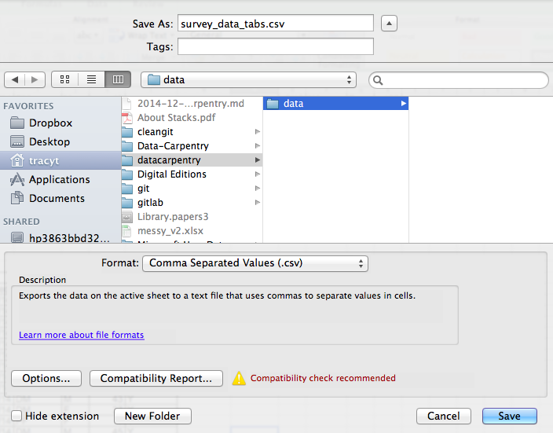

Storing the data you're going to work with for your analyses in Excel
default file format (`*.xls` or `*.xlsx` - depending on the Excel
version) is a **bad idea**. Why?

- Because it is a **proprietary format**, and it is possible that in
  the future, technology won’t exist (or will become sufficiently
  rare) to make it inconvenient, if not impossible, to open the file.

  Think about zipdisks. How many old theses in your lab are “backed
  up” and stored on zipdisks? Ever wanted to pull out the raw data
  from one of those? *Exactly.*

- **Other spreadsheet software** may not be able to open files
  saved in a proprietary Excel format.

- **Different versions of Excel** may handle data
  differently, leading to inconsistencies.

<!-- - Finally, more **journals and grant agencies** are requiring you -->
<!--   to deposit your data in a data repository, and most of them **don't -->
<!--   accept Excel format**. It needs to be in one of the formats -->
<!--   discussed here. -->

As an example, do you remember how we talked about how Excel stores **dates** earlier? Turns out there are **multiple defaults for different versions of the software**. And you can switch between them all willy-nilly. So, say you’re compiling Excel-stored data from multiple sources. There’s dates in each file- Excel interprets them as their own internally consistent serial numbers. When you combine the data, Excel will take the serial number from the place you’re importing it from, and interpret it using the rule set for the version of Excel you’re using. Essentially, you could be adding a huge error to your data, and it wouldn’t necessarily be flagged by any data cleaning methods if your ranges overlap.

Storing data in a **universal**, **open**, **static format** will help deal with this problem. Try **tab-delimited** or **CSV** (more common). CSV files are plain text files where the columns are separated by commas, hence 'comma separated variables' or CSV. The advantage of a CSV over an Excel/SPSS/etc. file is that we can open and read a CSV file using just about any software, including a simple **text editor**. Data in a CSV can also be **easily imported** into other formats and environments, such as SQLite and R. We're not tied to a certain version of a certain expensive program when we work with CSV, so it's a good format to work with for maximum portability and endurance. Most spreadsheet programs can save to delimited text formats like CSV easily, although they complain and make you feel like you’re doing something wrong along the way.

To save a file you have opened in Excel in `*.csv` format:

1. From the top menu select 'File' and 'Save as'.
2. In the 'Format' field, from the list, select 'Comma Separated Values' (`*.csv`).
3. Double check the file name and the location where you want to save it and hit 'Save'.



An important note for backwards compatibility: you can open CSVs in Excel!

## A Note on Cross-platform Operability
(or, how typewriters are ruining your work)

By default, most coding and statistical environments expect UNIX-style line endings (`\n`) as representing line breaks.  However, Windows uses an alternate line ending signifier (`\r\n`) by default for legacy compatibility with Teletype-based systems.  As such, when exporting to CSV using Excel, your data will look like this:

>data1,data2\r\n1,2\r\n4,5\r\n…

which, upon passing into most environments (which split on `\n`), will parse as:

>data1<br>
>data2\r<br>
>1<br>
>2\r<br>
>...

thus causing terrible things to happen to your data.  For example, `2\r` is not a valid integer, and thus will throw an error (if you’re lucky) when you attempt to operate on it in R or Python.  Note that this happens on Excel for OSX as well as Windows, due to legacy Windows compatibility.

There are a handful of solutions for enforcing uniform UNIX-style line endings on your exported CSVs:

1. When exporting from Excel, save as a “Windows comma separated (.csv)” file
2. If you store your data file under version control (which you should be doing!) using Git, edit the `.git/config` file in your repository to automatically translate `\r\n` line endings into `\n`.
   Add the follwing to the file ([see the detailed tutorial](http://nicercode.github.io/blog/2013-04-30-excel-and-line-endings)):

   ```
   [filter "cr"]
   clean = LC_CTYPE=C awk '{printf(\"%s\\n\", $0)}' | LC_CTYPE=C tr '\\r' '\\n'
   smudge = tr '\\n' '\\r'` 
   ```
   
   and then create a file `.gitattributes` that contains the line:
 
   ```
   *.csv filter=cr
   ```
	
3. Use [dos2unix](http://dos2unix.sourceforge.net/) (available on OSX, *nix, and Cygwin) on local files to standardize line endings.

#### A note on Python and `xls`

There are Python packages that can read `xls` files (as well as
Google spreadsheets). It is even possible to access different
worksheets in the `xls` documents.

**But**

- this equates to replacing a (simple but manual) export to `csv` with
  additional complexity/dependencies in the data analysis Python code
- **data formatting best practice STILL apply**
- Is there really a good reason why `csv` (or similar) is not adequate?
